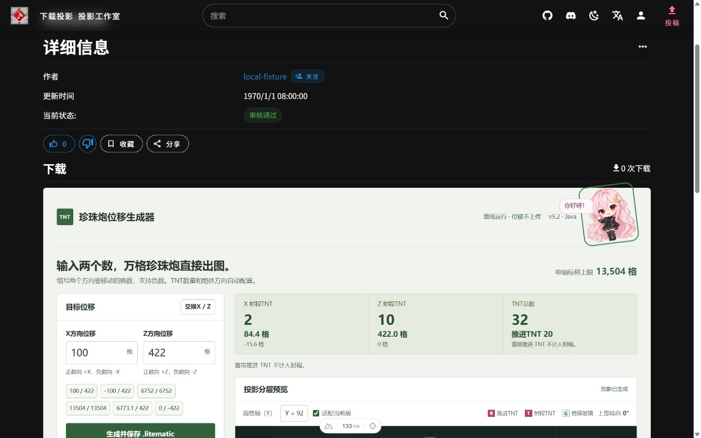
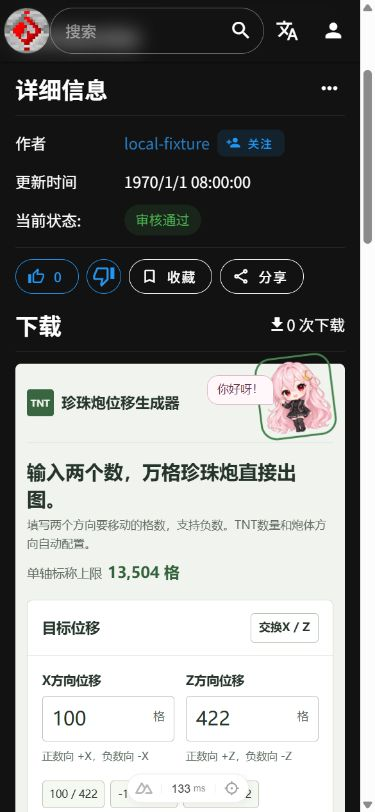

# v9.2 pearl cannon generator

The `91tvzzp1` page has one native generator with X and Z displacement inputs (X方向位移 and Z方向位移 in Simplified Chinese). Download, materials, preview, and exports use the generated schematic directly. The pearl-cannon section now spans the page width to fit its two-column layout; other machines retain their size-based inputs and backend endpoints. Attribution, comments, and the surrounding page features are unchanged.

## Implementation

`public/generators/pearl-cannon-v9.2.html` is the complete shipped v9.2 standalone source, including the NBT reader/writer, embedded templates, geometry assembly, and original UI. The historic `pearl-cannon-v9.html` remains accessible. The native UI uses the supplied transparent Yueyue PNG, verified as SHA256 `b73f2d265201f54460faa9b1da647ede85527e40b6b6625660d054bda06a7ff3`. Its click animation and greeting reset after 1600 ms; repeated clicks restart the timer. No new production dependencies or backend endpoints are introduced.

`components/litematica/LitematicaGenDownloader.vue` selects `PearlCannonDownloader.vue` only for this machine. The native form uses v9.2's light sage background, white cards, dark green actions, and responsive two-column arrangement. Yueyue stays in the header's normal document flow. Seven preview layers, presets, X/Z swap, material CSV, parameter export, original-template download, and DataVersion remain available. The standalone asset remains available through an advanced link for compatibility. Local downloads do not increment the existing backend's download counter.

`utils/pearl-cannon/core.mjs` contains the complete v9.2 core verbatim, with a bundled-template loader appended. Run `node script/sync-pearl-cannon.mjs` after updating the standalone source. Tests enforce core equality, deterministic byte-for-byte export equivalence, and parsed NBT equivalence. The native entry point is dynamically imported on the client, and uses no iframe, runtime eval, or new backend endpoint. Its container avoids nesting an HTML form inside the existing page form.

The standalone source has an AGPL-3.0-only SPDX declaration. Embedded schematics retain the author metadata `Yisibite`. Template SHA256 values are:

- Original template: `900be1434d843523f4dbaaa4e55b4fc5bdd7a7423670e1f2ef064dc70f1864e4`.
- Larger template: `6e43dfcea3f4bd7d7bccfedc1345be0b7858e023d1aa6d0360903fdc831a413b`.

Please review template provenance and redistribution permission before merging. A Minecraft server JAR, local credentials and test-world files are not included.

## Generation rules

Signed X/Z inputs use exact decimal rounding at 42.2 blocks per payload TNT. Halfway values round away from zero. The fixed first row of each active array contains 10 propulsion TNT; these move the other TNT and are excluded from the displacement calculation.

An axis with absolute input below 21.1 rounds to zero, so its independent array and propulsion row are omitted. Exactly 21.1 still uses one payload TNT. Both axes rounding to zero produces a validation error instead of a schematic.

At absolute input 6773.1, the payload rounds to 161 TNT and the second array is enabled. Each array holds at most 160 payload TNT, with at most two arrays per axis. Inputs below 13525.1 that round to 320 are accepted; 13525.1 requires 321 and is rejected. The nominal maximum is 13504 blocks per axis.

Surplus TNT is replaced with glass from the end opposite the coral fan. Large layouts omit all-glass payload rows and their dedicated replication parts, while preserving shared power and transport. Negative Z mirrors the complete upper cannon including the signal tower; the lower pearl correction keeps its direction and is translated and reconnected. Do not rotate or mirror the exported whole structure again.

The core still accepts `omitZeroAxes: false`, `removeEmptyRows: false`, and `negativeZMode: 'legacy-bypass'`. The last option is retained for compatibility and is outside the current validation scope. Preview layers, material CSV, parameter export, original-template download and DataVersion override are retained.

The two far second-array supports at unrotated large-template coordinates `(60,38,6)` and `(12,38,52)` use enchanting tables instead of ender chests, with the old block-entity data removed. A support changes only when its corresponding second array is actually generated. Near supports and the lower pearl correction retain their original blocks.

## Known limitations and prior game tests

This integration is submitted for review as experimental. Payload count and nominal distance are not a guarantee of the actual landing position. Receiving height, loaded chunks and directional drift still require checking.

The recorded v9 tests used an isolated Minecraft Java 1.21.10 server with Carpet 1.4.188. Across 24 real upward pearl throws, all payload TNT reached the expected per-axis clusters and there was no material loss. Only 20 pearls exited; four collided early in the unchanged lower correction. These are historical v9 tests, not game tests rerun for this website integration. The original raw traces remain in the development archive, rather than being included in this repository.

A known damaging combination is payload X=301, Z=-1 (nominal input X=12702.2, Z=-42.2). It also failed in the earlier layout with glass rows retained. Its cause has not been fixed. The existing red warning, explicit test-world acknowledgement and output metadata are preserved. The enchanting-table adjustment has not been game-tested for every direction and count. Other untested extreme ratios must not be assumed safe.

## Reproducing the integration checks

Run `pnpm test:pearl-cannon` (or `node --test test/pearl-cannon.test.mjs test/pearl-cannon-native.test.mjs`) using Node 22 or later. The 12 tests exercise the standalone core and the native module, assert that all original core text is retained, and compare the bytes exported by both entry points at a fixed timestamp and DataVersion. They cover decimal boundaries, all 1280 single-axis count/direction combinations, TNT accounting, retained option overrides, parsed NBT blocks and block entities, far support counts, and the known-failure guard. This v9.2 integration passed all 12 tests. The supplied source's 140-configuration audit, 14-export comparison, and DOM-stub interaction tests were also rerun and passed.

The normal full-site build requires the CI-generated `assets/hash.json`. After generating it in the same form as `.github/workflows/node.js.yml`, `pnpm build` with the default approximately 4 GB Node heap completed client compilation, SSR compilation, and prerendering, then ran out of heap during final Nitro bundling. Repeating the unmodified build with `NODE_OPTIONS=--max-old-space-size=8192` completed successfully and produced `.output/server/index.mjs`. No backend fixture or SSR override was used for this build.

In the browser, the pearl page had exactly one X and one Z displacement input and no old size inputs. All seven preview layers selected, the 43-row material list opened, and the `.litematic`, CSV, JSON, and original template downloads were actually triggered. The saved `.litematic` was read back: DataVersion 4556, 2117 blocks, 32 TNT, 52 block entities, and no block-state differences against the native result for 100/422. Zero displacement and 13525.1/422 were rejected; 12702.2/-42.2 displayed its known explosion warning and required acknowledgement. Another machine still showed the original size fields and download controls.

Browser checks used a temporary, local-only `ssr=false` setting because the development SSR public-asset resolver returned HTTP 400. A loopback metadata fixture supplied page content because the remote API's TLS certificate did not match its hostname on this machine. Neither the setting nor fixture is in the PR; the successful production build above used normal SSR. The 1440px desktop page showed side-by-side controls and preview, and the 390px mobile page stacked them without horizontal overflow. Yueyue's mouse click, repeat timer, 1600ms recovery, and Enter-key activation were checked with unchanged displacement inputs. Game mechanics were not retested for this website integration.

A follow-up self-review checked the full 13504/13504 layout in the browser: both far supports appear as two enchanting tables in the 43-item material list, and every material shown has a Chinese name. At 6773.1/422 the page shows the far-support game-test warning and one enchanting table. At 12702.2/-42.2 it shows the v9.2-specific blast history and still disables download until acknowledged. Preview layer changes clear the previous block's tooltip; the pointer handler now clears on mouse leave only, so touch pointer exit does not immediately erase a tapped block's details. The English expansion labels were also checked. A supplemental `REMOTE=false` build using only the minimal page metadata fixture exited without a server artifact after an unrelated home-page prerender `undefined.map` error; it is not counted as a production-build pass. The normal, unmodified SSR build and GitHub CI build passed.

## Native page preview

The screenshots below come from the actual browser-rendered site with local metadata fixture content, not a production deployment.

