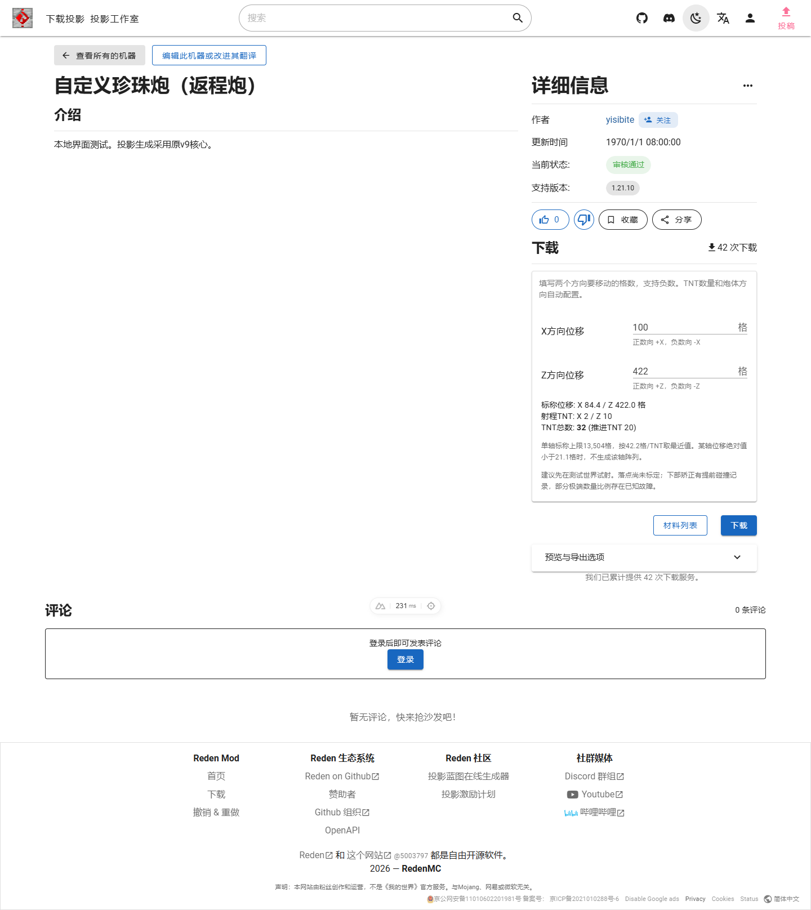
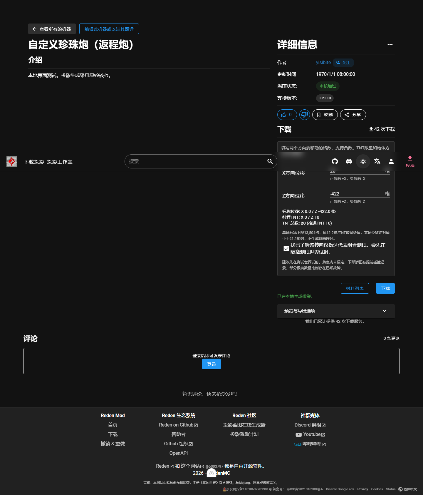

# Displacement-based pearl cannon generator

The `91tvzzp1` schematic now uses the original download location with two native Vuetify inputs: X displacement and Z displacement (X方向位移 and Z方向位移 in Simplified Chinese). The original download and materials buttons operate on the generated schematic. There is no additional top-of-page panel or iframe. Other machines retain their size-based inputs and backend endpoints. Attribution, comments and the surrounding page layout are unchanged.

## Implementation

`public/generators/pearl-cannon-v9.html` is the complete v9 standalone source, including the NBT reader/writer, embedded templates, geometry assembly, UI and original CSS. It is intentionally self-contained and retains its existing options. The shipped file equals the previously delivered v9 artifact after CRLF-to-LF normalization only. The normalized SHA256 is `0fe65461a267904a288b396a6df6550192fd24602b66ab571e16e33029009655`; the original release SHA256 is `66d575ccde36f6b13d1ef72fdca075421b074b5250ee4a74e3a0a6a3f4f04e02`. No new production dependencies or backend endpoints are introduced.

`components/litematica/LitematicaGenDownloader.vue` selects `PearlCannonDownloader.vue` only for this machine. The new UI uses site typography, theme colors, underlined inputs, standard action buttons and dialogs. Preview layers, presets, X/Z swap, material CSV, parameter export, original-template download and DataVersion remain available under native advanced options. The standalone asset remains available through an advanced link for compatibility. Local downloads do not increment the existing backend's download counter.

`utils/pearl-cannon/core.mjs` contains the complete v9 core verbatim, with a bundled-template loader appended. Run `node script/sync-pearl-cannon.mjs` after updating the standalone source. Tests enforce core equality and byte-for-byte export equivalence. The native entry point is dynamically imported on the client, and uses no iframe, runtime eval or new backend endpoint. Its container avoids nesting an HTML form inside the existing page form.

The standalone source has an AGPL-3.0-only SPDX declaration. Embedded schematics retain the author metadata `Yisibite`. Template SHA256 values are:

- Original template: `900be1434d843523f4dbaaa4e55b4fc5bdd7a7423670e1f2ef064dc70f1864e4`.
- Larger template: `6e43dfcea3f4bd7d7bccfedc1345be0b7858e023d1aa6d0360903fdc831a413b`.

Please review template provenance and redistribution permission before merging. A Minecraft server JAR, local credentials and test-world files are not included.

## Generation rules

Signed X/Z inputs use exact decimal rounding at 42.2 blocks per payload TNT. Halfway values round away from zero. The fixed first row of each active array contains 10 propulsion TNT; these move the other TNT and are excluded from the displacement calculation.

An axis with absolute input below 21.1 rounds to zero, so its independent array and propulsion row are omitted. Exactly 21.1 still uses one payload TNT. Both axes rounding to zero produces a validation error instead of a schematic.

At absolute input 6773.1, the payload rounds to 161 TNT and the second array is enabled. Each array holds at most 160 payload TNT, with at most two arrays per axis. Inputs below 13525.1 that round to 320 are accepted; 13525.1 requires 321 and is rejected. The nominal maximum is 13504 blocks per axis.

Surplus TNT is replaced with glass from the end opposite the coral fan. Large layouts omit all-glass payload rows and their dedicated replication parts, while preserving shared power and transport. Negative Z mirrors the complete upper cannon including the signal tower; the lower pearl correction keeps its direction and is translated and reconnected. Do not rotate or mirror the exported whole structure again.

The core still accepts `omitZeroAxes: false`, `removeEmptyRows: false`, and `negativeZMode: 'legacy-bypass'`. The last option is retained for compatibility and is outside the current validation scope. Preview layers, material CSV, parameter export, original-template download and DataVersion override are retained.

## Known limitations and prior game tests

This integration is submitted for review as experimental. Payload count and nominal distance are not a guarantee of the actual landing position. Receiving height, loaded chunks and directional drift still require checking.

The recorded v9 tests used an isolated Minecraft Java 1.21.10 server with Carpet 1.4.188. Across 24 real upward pearl throws, all payload TNT reached the expected per-axis clusters and there was no material loss. Only 20 pearls exited; four collided early in the unchanged lower correction. These are historical v9 tests, not game tests rerun for this website integration. The original raw traces remain in the development archive, rather than being included in this repository.

A known damaging combination is payload X=301, Z=-1 (nominal input X=12702.2, Z=-42.2). It also failed in the earlier layout with glass rows retained. Its cause has not been fixed. The existing red warning, explicit test-world acknowledgement and output metadata are preserved. Other untested extreme ratios must not be assumed safe.

## Reproducing the integration checks

Run `pnpm test:pearl-cannon` (or `node --test test/pearl-cannon.test.mjs test/pearl-cannon-native.test.mjs`) using Node 22 or later. The tests exercise the standalone core and the native module, assert that all original core text is retained, and compare the bytes exported by both entry points. They cover decimal boundaries, all 1280 single-axis count/direction combinations, TNT accounting, retained option overrides, NBT round trips and the known-failure guard.

The full-site build also depends on the existing top-level request in `nuxt.config.ts` to the production sitemap API. An unavailable sitemap is a build prerequisite failure; do not replace it with a fake result in production. Any offline fixture build must be reported separately from a normal production build.

For the native-UI follow-up to #37, all ten Node tests passed, including the original 1280 single-axis combinations and 13 byte-identical native/standalone export comparisons. Browser checks exercised the actual Nuxt client page against loopback API fixtures: eleven displacement cases, known-failure acknowledgement, invalid input rejection, CSV/JSON/template exports, custom DataVersion, all three locales, both site themes and a 430 px mobile viewport. No JavaScript errors were recorded. Another machine retained its two original size inputs, and pearl downloads never called the old size-based endpoint.

Browser checks used a temporary, local-only `ssr=false` setting because the development SSR public-asset resolver returned HTTP 400. This setting and the backend fixture are not part of the PR. Client and SSR production compilation passed separately, but content prerendering failed with an undefined `map` error and no runnable server artifact was produced. The build command exited zero despite that failure; this is not a complete production-build pass. Game mechanics were not retested for this UI-only change.

## Native page preview

The screenshots below show the real site components with local fixture metadata, not a production deployment. Both light and dark themes inherit the site styling.

